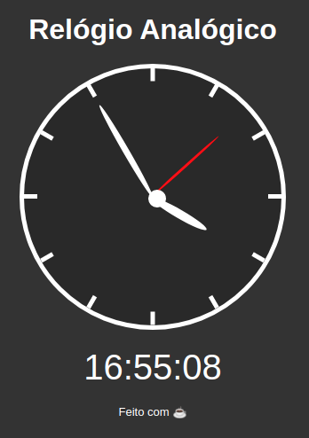

<h1 align="center">D7_CLOCK_BASE</h1>

    

# About this project

Project made with javascript vanilla to represent an analogyc and digital clock.

Don't spread your time and see work [here](https://jeferson1.github.io/D7JS_CLOCK_BASE/)